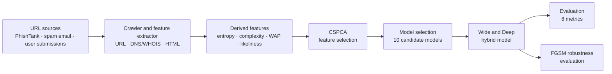
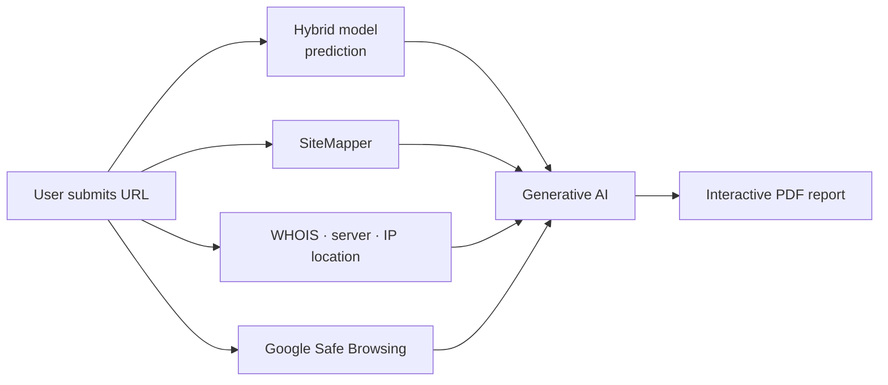

<div align="center">

# 🛡️ StealthPhisher

### A defensive framework against phishing attacks using hybrid deep learning and GenAI

[](https://doi.org/10.1016/j.eswa.2025.130205)
[](https://doi.org/10.17632/m2479kmybx.2)


**336,749 URLs · 99.85% accuracy · 98.70% accuracy under FGSM attack · GenAI-written PDF reports**

</div>

---

## 📑 Table of Contents

1. [Overview](#-overview)
2. [Key Highlights](#-key-highlights)
3. [Framework at a Glance](#-framework-at-a-glance)
4. [Dataset](#-dataset)
5. [Feature Engineering](#-feature-engineering)
6. [CSPCA Feature Selection](#-cspca-feature-selection)
7. [Model Architecture](#-model-architecture)
8. [Results](#-results)
9. [Adversarial Robustness](#-adversarial-robustness)
10. [GenAI-Powered Reporting](#-genai-powered-reporting)
11. [Limitations & Future Work](#-limitations--future-work)
12. [Repository Structure](#-repository-structure)
13. [Getting Started](#-getting-started)
14. [Utility Scripts](#-utility-scripts)
15. [Reproducibility Notes](#-reproducibility-notes)
16. [Responsible Use](#-responsible-use)
17. [Citation](#-citation)
18. [Acknowledgements](#-acknowledgements)

---

## 🔍 Overview

Phishing is one of the most common and costly cyber-attacks. Blacklists only catch what has
already been reported, and static rule-based systems break when attackers change domain names
or obfuscate URLs. **StealthPhisher** tackles this with a learning-based approach that
classifies a URL (and properties of the page behind it) as *legitimate* or *phishing*, and
then explains the verdict to non-technical users.

The framework brings together:

- **A large, recent dataset** of 336,749 labelled URLs with rich structural, statistical, and HTML-based features.
- **Class-Specific PCA (CSPCA)**, a feature selection method that scores features by their variance *within each class*.
- **A hybrid deep learning model** that combines a Wide & Deep neural network with feed-forward components.
- **FGSM-based adversarial evaluation** to test resilience against evasion attempts.
- **GenAI-generated PDF reports** that turn model output, WHOIS, server, and Safe Browsing data into plain-language findings.

> 📄 **Paper:** Arvind Prasad, Vibhu Yadav, Chirag Solanki, Harshit Goswami, Tanmay Jha, Dushyant Nagal.
> *StealthPhisher: A Defensive Framework against Phishing Attack using Hybrid Deep Learning and GenAI.*
> Expert Systems with Applications, 2025. [doi:10.1016/j.eswa.2025.130205](https://doi.org/10.1016/j.eswa.2025.130205)
>
> 🏛️ Department of Computer Engineering and Applications, GLA University, Mathura, India

---

## ✨ Key Highlights

| | |
|---|---|
| 📊 **Large, current dataset** | 336,749 records: 160,943 legitimate and 175,806 phishing URLs from PhishTank, spam email, and user submissions |
| 🧮 **Rich, multi-source features** | URL, SSL, HTML/DOM, redirection, content, keyword, media, hyperlink, interaction, and derived features |
| 🧬 **Statistical features** | Shannon Entropy, Kolmogorov Complexity, Fractal Dimension, Weighted Average Probabilities, Hex/Base64 pattern counts, Likeliness Index |
| ✂️ **CSPCA** | Novel class-specific PCA that keeps features that matter to *either* class |
| 🧠 **Hybrid model** | Wide (linear) and Deep (64 → 32) branches fused by a final sigmoid layer |
| ⚔️ **Adversarial robustness** | 98.70% accuracy on an FGSM-generated adversarial dataset |
| 🤖 **GenAI reports** | Interactive PDF reports with a verdict, visuals, and actionable advice for non-technical users |
| 📏 **Eight metrics** | Accuracy, Precision, Sensitivity, F1, MCC, Markedness, Youden's J, Fowlkes–Mallows |

---

## 🧭 Framework at a Glance

**Training and evaluation**



**Inference and reporting**



---

## 🗂️ Dataset

Generated at the **Cybersecurity Lab, GLA University** and published on Mendeley Data.

| Property | Value |
|---|---|
| Total records | **336,749** |
| Legitimate URLs | 160,943 (label `1`) |
| Phishing URLs | 175,806 (label `0`) |
| Sources | PhishTank, spam-email URLs, user-uploaded URLs |
| Collection | A crawler fetches HTML content, DNS data, and metadata for each URL, then a feature extractor builds the dataset |
| DOI | [10.17632/m2479kmybx.2](https://doi.org/10.17632/m2479kmybx.2) |

> 🏷️ **Label convention:** legitimate = `1` (the "positive" class in the metrics), phishing = `0`.

> ⚠️ The CSV files are **not stored in this repository**. Download `StealthPhisher2025.csv`
> from Mendeley Data and place it in the repository root. See [Getting Started](#-getting-started).

---

## 🧬 Feature Engineering

The dataset groups features into URL-based, DNS/WHOIS-based, and HTML content-based families.

| Family | Examples | Why it matters |
|---|---|---|
| **URL structure** | `LengthOfURL`, `DomainLengthOfURL`, `URLComplexity`, `IsDomainIP`, `TLDLength`, `NumberOfSubdomains` | Phishing URLs tend to be long, complex, IP-based, or use unusual TLDs |
| **Character statistics** | `LetterCntInURL`, `DigitCntInURL`, `EqualCharCntInURL`, `QuesMarkCntInURL`, `AmpCharCntInURL`, `OtherSpclCharCntInURL` and their ratios | Many digits and special characters suggest obfuscation or tracking identifiers |
| **SSL / connection** | `HasSSL`, `IsUnreachable` | Missing SSL or unreachable hosts are red flags (though phishing sites increasingly use SSL) |
| **HTML / DOM** | `LineOfCode`, `LongestLineLength`, `HasTitle`, `HasFavicon`, `HasRobotsBlocked`, `IsResponsive` | Phishing pages are often minimal, auto-generated, or obfuscated |
| **Redirection** | `IsURLRedirects`, `IsSelfRedirects` | Redirects hide the true destination |
| **Content / structure** | `HasDescription`, `HasPopup`, `HasIFrame`, `IsFormSubmitExternal`, `HasPasswordFields`, `HasHiddenFields`, `HasSubmitButton`, `HasSocialMediaPage` | Forms that post to external domains and password fields are key indicators |
| **Keywords** | `HasBankingKey`, `HasPaymentKey`, `HasCryptoKey`, `HasCopyrightInfoKey` | Financial keywords hint at credential-harvesting pages |
| **Media / resources** | `CountImages`, `CountFilesCSS`, `CountFilesJS` | Phishing sites often have few or unrelated resources |
| **Hyperlinks / interaction** | `CountSelfHRef`, `CountEmptyRef`, `CountExternalRef`, `CountPopup`, `CountIFrame` | Heavy external or empty links suggest redirection or poor development |
| **Derived** | See below | Statistical fingerprints of how a URL is written |

### Derived features

Computed by `StealthPhisher_ExtendedFeatures.ipynb` and saved to `ExtendedFeatures.csv`.

| Feature | Idea |
|---|---|
| `ShannonEntropy` | Character-level entropy of the URL. Random-looking strings score higher (phishing URLs extend to ~5.5, legitimate ones peak near 4.0) |
| `KolmogorovComplexity` | Approximated as zlib-compressed length divided by original length |
| `FractalDimension` | Unique path tokens divided by total path tokens, capturing repetitive structure |
| `HexPatternCnt` | Count of hexadecimal-looking tokens |
| `Base64PatternCnt` | Count of Base64-looking tokens |
| `WAPLegitimate` | Weighted Average Probability: mean character frequency of the URL (dots removed) under the *legitimate* class character distribution |
| `WAPPhishing` | The same measure under the *phishing* class distribution |
| `LikelinessIndex` | Similarity of a domain to well-known legitimate domains (see below) |

### Likeliness ("Linklyness") Index

`StealthPhisher_LinklynessIndex.ipynb` implements a custom, Jaro-style similarity score from 0.0
(dissimilar) to 1.0 (identical). It combines the fraction of matching characters, transpositions,
and a common-prefix bonus, normalised by string length:

```
Likeliness Index = ¼ · ( m/len1 + m/len2 + (m − t)/m + prefix_length / max(len1, len2) )
```

Here `m` is the number of matching characters, `t` the number of transpositions, and the prefix
is capped at 4 characters. The notebook scores a target domain against `top10milliondomains.csv`
and uses **CuPy** for GPU acceleration. Legitimate URLs concentrate near the high end, which
makes the score useful for spotting typosquatting and lookalike domains.

---

## ✂️ CSPCA Feature Selection

Ordinary PCA treats the dataset as a whole and can overlook patterns that matter only to one
class. **Class-Specific PCA (CSPCA)** keeps those patterns:

1. **Scale** all numeric features with `StandardScaler`.
2. **Split** the data into legitimate and phishing subsets.
3. **Run PCA on each subset** and take each feature's explained-variance ratio.
4. **Average** the two class-wise scores into one importance score per feature.
5. **Threshold** the combined scores to keep the most informative features (the paper's method description uses a cutoff of 0.02).
6. **Visualise** the rankings per class, combined, and as a share-of-variance pie chart.

The surviving **28 features** (the ones used by the final model) are:

| Group | Features |
|---|---|
| **URL structure** | `LengthOfURL`, `URLComplexity`, `CharacterComplexity`, `DomainLengthOfURL`, `IsDomainIP`, `TLDLength`, `NumberOfSubdomains`, `HavingPath`, `PathLength`, `HavingQuery`, `HavingFragment`, `HavingAnchor` |
| **Character statistics** | `LetterCntInURL`, `URLLetterRatio`, `DigitCntInURL`, `URLDigitRatio`, `EqualCharCntInURL`, `QuesMarkCntInURL`, `AmpCharCntInURL`, `OtherSpclCharCntInURL`, `URLOtherSpclCharRatio`, `NumberOfHashtags` |
| **Reachability & transport** | `HasSSL`, `IsUnreachable` |
| **Page content** | `LineOfCode`, `LongestLineLength`, `HasTitle`, `HasFavicon` |

`LengthOfURL` and `URLComplexity` carry the largest explained-variance share in both classes.

Relevant notebooks: `StealthPhisher_Importance.ipynb`, `StealthPhisher_FS_Threshold.ipynb`,
`StealthPhisher_FS_Final.ipynb`.

---

## 🧠 Model Architecture

### Choosing the model

Ten deep learning candidates were compared during model selection. The **Wide & Deep Neural
Network** and the **Feed-Forward Neural Network** were the two strongest and most complementary,
so they form the hybrid.

| Model | Accuracy | F1 | Time (s) |
|---|---|---|---|
| **Wide and Deep Neural Network** | **0.9868** | 0.9862 | 93 |
| **Feed-Forward Neural Network** | 0.9820 | 0.9813 | 86 |
| Restricted Boltzmann Machine | 0.9709 | 0.9693 | 46 |
| Sparse Network | 0.9417 | 0.9417 | 175 |
| Attention-based MLP | 0.9347 | 0.9355 | 137 |
| NODE-based Model | 0.9322 | 0.9334 | 136 |
| MicroNet Hybrid | 0.5942 | 0.2645 | 912 |
| SENet Hybrid | 0.5228 | 0.0059 | 844 |
| RegNet Hybrid | 0.5227 | 0.0048 | 1603 |
| Transformer | 0.5216 | 0.0000 | 869 |

*(Model-selection stage, from the paper. Final-model results are below.)*

### The hybrid

The wide part **memorises** explicit feature correlations and sparse, high-cardinality cues
(e.g. TLDs); the deep part **generalises** to non-linear, unseen patterns. A final dense layer
learns how to weigh the two.

```
                  ┌─────────────── Wide branch ───────────────┐
 scaled features ─┤  Dense(1, sigmoid)                         ├─┐
                  └────────────────────────────────────────────┘ │
                                                                  ├─ Concatenate ─ Dense(1, sigmoid) ─ P(legitimate)
                  ┌─────────────── Deep branch ───────────────┐ │
 scaled features ─┤  Dense(64, ReLU) → Dense(32, ReLU) →       ├─┘
                  │  Dense(1, sigmoid)                         │
                  └────────────────────────────────────────────┘
```

| Setting | Value |
|---|---|
| Framework | TensorFlow / Keras |
| Optimizer | Adam, learning rate `0.001` |
| Loss | Binary cross-entropy |
| Batch size / max epochs | 64 / 100 |
| Regularization | `EarlyStopping` on `val_loss`, patience 10, best weights restored |
| Split | 80 / 20, stratified, `random_state=42` |
| Preprocessing | `StandardScaler` fitted on the training set only |
| Decision threshold | 0.5 |

---

## 📈 Results

Test-set performance of the final model (`StealthPhisher_Model_Final.ipynb`):

| Metric | Score |
|---|---|
| Accuracy | **0.99856** |
| Precision | 0.997674 |
| Sensitivity (Recall) | 0.999317 |
| F1 Score | 0.998495 |
| Matthews Correlation Coefficient | 0.997115 |
| Markedness | 0.995541 |
| Youden's J | 0.997183 |
| Fowlkes–Mallows Index | 0.998495 |

**Confusion matrix** (67,350 test URLs, legitimate = positive class):

|  | Predicted phishing | Predicted legitimate |
|---|---|---|
| **Actually phishing** | 35,086 | 75 |
| **Actually legitimate** | 22 | 32,167 |

Training and validation curves converge closely and stabilise above 99.8% accuracy with no
sign of overfitting. The notebook also produces ROC and loss plots, saved to `charts/`.

> Figures can vary slightly between runs and library versions. The paper rounds some values differently from the notebook.

---

## ⚔️ Adversarial Robustness

Attackers adapt, so the model is evaluated against evasion attacks.

- **Attack:** Fast Gradient Sign Method, `x_adv = clip(x + ε · sign(∇ₓJ(θ, x, y)))` with `ε = 0.1`
- **Result:** **98.70% accuracy** on the FGSM-generated adversarial dataset
- **Pattern:** precision and markedness stay high or improve under attack, while sensitivity, F1, MCC, and Youden's J dip slightly, so the model becomes a little less able to catch every phishing sample but rarely raises false alarms
- **Two implementations in the notebooks:**
  - a custom PyTorch FGSM generator that writes `FGSM_Adversarial_Attack_Dataset.csv`
  - the [Adversarial Robustness Toolbox (ART)](https://github.com/Trusted-AI/adversarial-robustness-toolbox) `FastGradientMethod` wrapped around the trained Keras model

See `StealthPhisher_Model_Final_AdvAttack.ipynb` and
`StealthPhisher_Model_with_Robustness_against_Adversarial_Attack.ipynb`.

The final notebook also scores the trained model on `gretel.ai.csv`, a 50k-record synthetic
dataset, as an additional generalisation check.

---

## 🤖 GenAI-Powered Reporting

A detection score alone is hard for non-technical users, especially people who are most
vulnerable to phishing. StealthPhisher uses generative AI to turn the evidence into an
**interactive PDF report** containing the verdict, charts and tables, and recommended next steps.

| Component | What it contributes |
|---|---|
| **Hybrid model** | Phishing / legitimate prediction |
| **SiteMapper** | Graph of links and redirects from the page. Sparse internal linking is typical of phishing pages |
| **WHOIS extractor** | Registrar, creation and expiry dates, registrant details. Very new domains are a warning sign |
| **Server details** | Server type, IP, status code, missing security headers |
| **IP location** | Country, city, and ISP of the host |
| **Google Safe Browsing** | Cross-check against Google's database of known harmful URLs |
| **Generative AI** | Combines everything into a readable, actionable report |

The report generator uses Google's LearnLM-1.5-Pro-Experimental model (earlier iterations used Gemini-1.5 Flash).
`StealthPhisher_Sitemap.py` and `StealthPhisher_Google_Safe_Browsing.py` correspond to the SiteMapper and Safe Browsing
components described in the paper.

---

## 🚧 Limitations & Future Work

- **Multilingual phishing** is not yet covered, which limits global applicability.
- **Polymorphic phishing**, which changes form rapidly to evade detection, is not explicitly addressed.
- Planned work: multilingual support and **real-time adaptive learning** to respond to zero-day phishing tactics.

---

## 📁 Repository Structure

```
StealthPhisher/
├── DatasetConstruction/                          # Dataset construction code
├── GenAI/                                        # GenAI report-generation module
│
├── StealthPhisher_Dataset_Graphs.ipynb           # Dataset visualisations
├── StealthPhisher_ExtendedFeatures.ipynb         # Entropy, complexity, pattern & WAP features
├── StealthPhisher_LinklynessIndex.ipynb          # Domain similarity vs. top domains (GPU)
│
├── StealthPhisher_Importance.ipynb               # Feature importance (CSPCA rankings)
├── StealthPhisher_FS_Threshold.ipynb             # Feature selection (threshold-based)
├── StealthPhisher_FS_Final.ipynb                 # Final feature selection
│
├── StealthPhisher_Model_Selection.ipynb                    # Model comparison
├── StealthPhisher_Model_Selection_SelectedFeatures.ipynb   # Comparison on selected features
├── StealthPhisher_Final_Model_Selection.ipynb              # Final model-selection round
├── StealthPhisher_Final1_Model_Selection.ipynb             # Final model-selection round (variant)
│
├── StealthPhisher_Model_Final.ipynb              # ⭐ Final hybrid model + metrics
├── StealthPhisher_Model_Final_V1.ipynb           # Final model, version 1
├── StealthPhisher_Model_Final_V2.ipynb           # Final model, version 2
├── StealthPhisher_Model_Final_AdvAttack.ipynb    # FGSM attack and evaluation
├── StealthPhisher_Model_with_Robustness_against_Adversarial_Attack.ipynb
├── StealthPhisher_MisclassificationHandler.ipynb # Analysis of misclassified samples
│
├── StealthPhisher_Google_Safe_Browsing.py        # Safe Browsing API checker
└── StealthPhisher_Sitemap.py                     # SiteMapper: link-graph crawler & plotter
```

---

## 🚀 Getting Started

### 1. Clone

```bash
git clone https://github.com/coldman07/StealthPhisher.git
cd StealthPhisher
```

### 2. Create an environment

The paper reports Python **3.11.7**.

```bash
python -m venv .venv
source .venv/bin/activate        # Windows: .venv\Scripts\activate
```

### 3. Install dependencies

```bash
pip install pandas numpy scikit-learn matplotlib seaborn jupyter \
            tensorflow torch pytorch-tabnet \
            adversarial-robustness-toolbox \
            requests beautifulsoup4 networkx
```

Optional, only for the Likeliness Index notebook (needs an NVIDIA GPU and a matching CUDA toolkit):

```bash
pip install cupy-cuda12x          # pick the build that matches your CUDA version
```

### 4. Get the data

Download the dataset from Mendeley Data ([doi:10.17632/m2479kmybx.2](https://doi.org/10.17632/m2479kmybx.2))
and place the files in the repository root:

| File | Used by |
|---|---|
| `StealthPhisher2025.csv` | Feature, model, and robustness notebooks |
| `gretel.ai.csv` | Synthetic-data generalisation check (50k records) |
| `top10milliondomains.csv` | Likeliness Index (needs a `url` column) |

Also create the folder the notebooks save figures into:

```bash
mkdir charts
```

### 5. Run the notebooks

```bash
jupyter lab
```

Suggested order for following the research workflow:

1. `StealthPhisher_Dataset_Graphs.ipynb`: explore the data
2. `StealthPhisher_ExtendedFeatures.ipynb` and `StealthPhisher_LinklynessIndex.ipynb`: build derived features
3. `StealthPhisher_Importance.ipynb`, `StealthPhisher_FS_Threshold.ipynb`, `StealthPhisher_FS_Final.ipynb`: CSPCA feature selection
4. `StealthPhisher_Model_Selection*.ipynb`: compare models
5. `StealthPhisher_Model_Final.ipynb`: train and evaluate the final model
6. `StealthPhisher_Model_Final_AdvAttack.ipynb`: test robustness

---

## 🧰 Utility Scripts

### Google Safe Browsing checker: `StealthPhisher_Google_Safe_Browsing.py`

Queries the [Safe Browsing v4 `threatMatches:find`](https://developers.google.com/safe-browsing) API
for malware, social-engineering, unwanted-software, and potentially-harmful-application
threats across Windows, Linux, Android, iOS, and macOS.

```python
from StealthPhisher_Google_Safe_Browsing import check_url_safety

print(check_url_safety("YOUR_API_KEY", "http://example.com"))
```

You need your own Safe Browsing API key. Do not commit it to the repository.

### SiteMapper: `StealthPhisher_Sitemap.py`

Crawls outgoing links from a starting URL (depth 2, up to 5 links per page, multithreaded)
and plots the result as a directed graph with NetworkX and Matplotlib. It shows how a
suspicious page connects to other domains.

```bash
python StealthPhisher_Sitemap.py
# enter the url: https://example.com
```

---

## 🔁 Reproducibility Notes

- Splits use `random_state=42` with stratification, so results are repeatable on the same data.
- Scalers are fitted on training data only to avoid leakage.
- The paper's experiments ran on Windows 11 (AMD Ryzen 7 7730U, 16 GB RAM) with Python 3.11.7.
- Notebooks write figures to `charts/`. Some paths use Windows-style separators, so adjust them on Linux or macOS.
- The TabNet imports (`pytorch-tabnet`) are present for comparison experiments. Install the package if you run those cells.
- Keras and ART APIs change between releases. If `art.estimators.classification.KerasClassifier` raises errors, pin versions of `tensorflow` and `adversarial-robustness-toolbox` that work together.

---

## ⚖️ Responsible Use

StealthPhisher is a **defensive** research project. The data, models, and tools here are
meant for detecting and studying phishing, evaluating detectors, and teaching. Do not use
them to build or operate phishing infrastructure. When crawling or probing URLs, respect
site terms and applicable law, and handle suspicious links in an isolated environment.

---

## 📚 Citation

If you use the dataset or code in your work, please cite the paper and the dataset.

```bibtex
@article{prasad2025stealthphisher,
  title   = {StealthPhisher: A Defensive Framework against Phishing Attack using Hybrid Deep Learning and GenAI},
  author  = {Prasad, Arvind and Yadav, Vibhu and Solanki, Chirag and Goswami, Harshit and Jha, Tanmay and Nagal, Dushyant},
  journal = {Expert Systems with Applications},
  year    = {2025},
  doi     = {10.1016/j.eswa.2025.130205}
}

@dataset{stealthphisher_dataset_2025,
  title     = {StealthPhisher Phishing Attack Dataset},
  author    = {Jha, Tanmay and Goswami, Harshit and Solanki, Chirag and Nagal, Dushyant and Yadav, Vibhu},
  publisher = {Mendeley Data},
  year      = {2025},
  version   = {2},
  doi       = {10.17632/m2479kmybx.2}
}
```

---

## 🙏 Acknowledgements

- **Arvind Prasad**, corresponding author and maintainer of the original repository, [`arvindbitm/StealthPhisher`](https://github.com/arvindbitm/StealthPhisher), which this repository is forked from.
- **Department of Computer Engineering and Applications and the Cybersecurity Lab, GLA University, Mathura**, where the dataset and framework were developed.
- **PhishTank** and the other open phishing and spam sources used for data collection.
- [Adversarial Robustness Toolbox](https://github.com/Trusted-AI/adversarial-robustness-toolbox), [TensorFlow](https://www.tensorflow.org/), [scikit-learn](https://scikit-learn.org/), and [Gretel.ai](https://gretel.ai/) for tooling used in the experiments.

---

<div align="center">

Maintained by [@coldman07](https://github.com/coldman07) · If this project helps your research, consider giving it a ⭐

</div>
